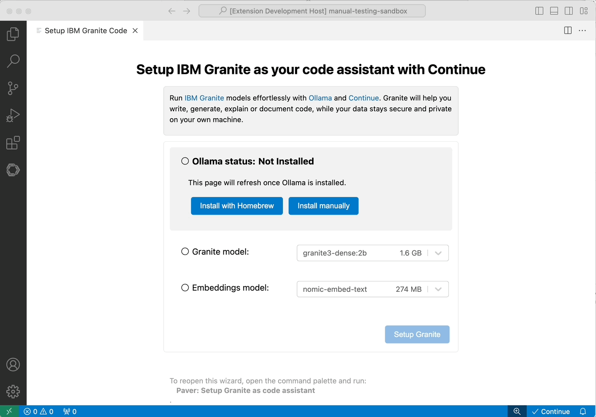
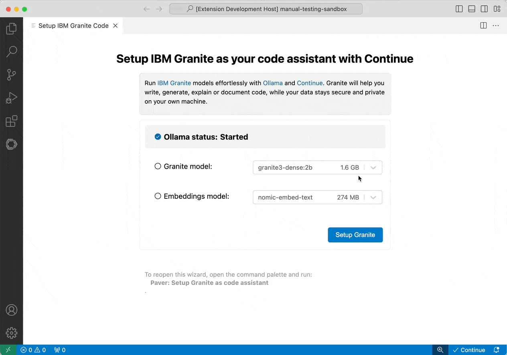

# Redhat-Paver-Code-Assist-Exercise
<!-- ABOUT THE PROJECT -->
### About The Project
The purpose of this repository is to provide a learning resource for using the [Red Hat Paver Code Assist extension](https://github.com/redhat-developer/vscode-paver) in Visual Studio Code. This extension aids developers by providing intelligent code suggestions and productivity-enhancing features tailored for Red Hat environments.

### Features
* Explore the functionalities of the Red Hat Paver Code Assist extension.
* Learn how to configure and optimize the extension for better code assistance.
* Practice exercises to improve your familiarity with the tool.

### Prerequisites

- **OS:** MacOS, Linux or Windows
- **Disk Space:** Minimum 30 GB
- **Latest Version of [Visual Studio Code](https://code.visualstudio.com/)**
- **[Paver Extention](https://marketplace.visualstudio.com/items?itemName=redhat.vscode-paver) installed** refer below for installing paver

### Getting Started

#### Step 1: Install the Extension

Open Visual Studio Code, navigate to the Extensions tab on the left sidebar,
select "Paver," and click "install."

The [Continue.dev](https://continue.dev/) extension will be automatically added
as a dependency, if not already installed. If you installed `Paver` manually,
you may need to also install the Continue extension separately.

#### Step 2: Install Ollama

Once the extension is running, the setup wizard will prompt you to install
Ollama.

The following Ollama installation options are available :

1. **Install with Homebrew:** If Homebrew is detected on your machine
   (Mac/Linux).
2. **Install with Script:** Available on Linux.
3. **Install automatically:** Available on Windows, will perform a silent
   installation using sensible defaults.
4. **Install Manually:** Supported on all platforms. If you choose this option,
   you will be redirected to the official
   [Ollama download page](https://ollama.com/download) to complete the
   installation.
Once Ollama is installed, the page will refresh automatically. Depending on the
security settings of your plateform, you may need to start Ollama manually the
first time.

### Step 3: Install Granite Models

Select the Granite model(s) you wish to install and follow the on-screen
instructions to complete the setup.

After the models are pulled into Ollama, Continue will be configured
automatically to use them, and the Continue chat view will open, allowing you to
interact with the models via the UI or tab completion.

Refer to the following links to learn more about [IBM Granite Models](https://github.com/ibm-granite/granite-3.0-language-models),[Continue.dev](https://docs.continue.dev) and [Ollama](https://ollama.com/).

### Exercises
The repository contains several exercises that you can use to practice and improve your skills with the Red Hat Paver Code Assist extension. 

* [testcases.md](https://github.com/IBM-developers/Redhat-Paver-Code-Assist-Exercise/tree/main/testcases.md)  has the 6 questions/scenarios along with instructions on how to use continue.dev in vscode and complete them.

we are testing for the chat compagainst the following model:
***granite3-dense:2b**

We hope these exercises enhance your experience with the Red Hat Paver Code Assist extension.Happy coding! 🚀

