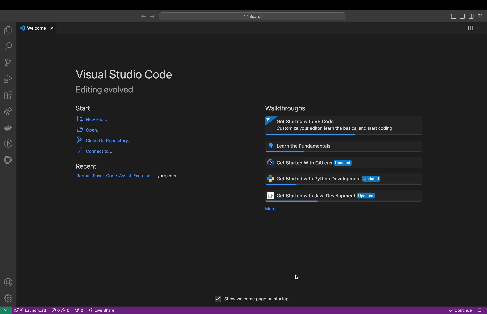
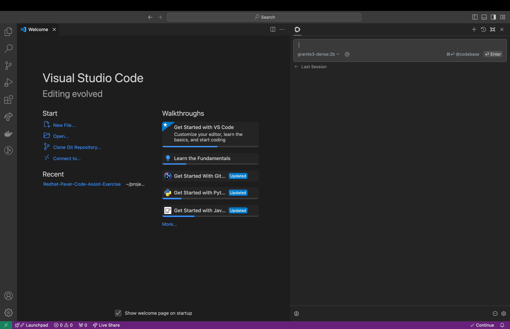

## Chat
### How to use it
Chat lets you easily ask for help from an LLM directly in the IDE. You send a task with any needed details, and it responds with text or code to complete it. If the response isn’t what you need, you can send follow-up messages to refine and adjust until the task is done.

The [Continue.dev](https://continue.dev/) extension will be automatically added after installing paver
The Continue logo will appear on the left sidebar. For a better experience, move Continue to the right sidebar

* #### Type a request and press enter
You can type your questions ,coding problems in the chat section and it will generate the answers for you 

* ##### Reference context with the @ symbol
If there is information from the codebase, documentation, IDE, or other tools that you want to include as context, you can type @ to select and include it as context.

To learn more about how to use chat refer this [link](https://docs.continue.dev/chat/how-to-use-it#how-to-use-it)

* ##### Scenarios 
Following are the sample question you can try it in the Paver-Code-Assist
Question 1: What is python?
Question 2: How do you declare constructors and destructors in Java?
Question 3: Write a Python program that checks if a number is positive, negative, or zero  
Question 4:  optimize the code for bubble sort algorithm 
optimize the code @bubblesort.py
Question 5: Add proper Javadoc comments in @Calculator.java
Question 6: create unit tests for count vowels in string
write unit tests for @unittest.py

Refer the [chat-testcase-results](https://github.com/IBM-developers/Redhat-Paver-Code-Assist-Exercise/blob/main/testcase-results/chat-testcase-results) folder for the  expected/sample output for the above questions 

## Autocomplete

### How to use it
Autocomplete shows code suggestions while you type. To turn it on, click the "Continue" button in the bottom-right corner of your IDE or make sure the "Enable Tab Autocomplete" option is checked in the settings.

* #### Accepting a full suggestion

Accept a full suggestion by pressing **Tab**

* #### Rejecting a full suggestion
Reject a full suggestion with **Esc**

* #### Partially accepting a suggestion
For more granular control, use **cmd/ctrl** + **→** to accept parts of the suggestion word-by-word.

Refer the below example added for the tab completion

1.Simple calculator using python

2. Rewrite fibinocci series in to recursive 

Refer the [tab-testcase-results](https://github.com/IBM-developers/Redhat-Paver-Code-Assist-Exercise/blob/main/testcase-results/tab-testcase-result) folder the result generated using tab completion for the above examples
